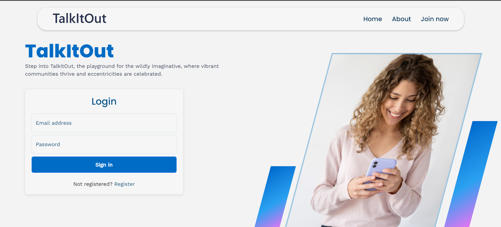
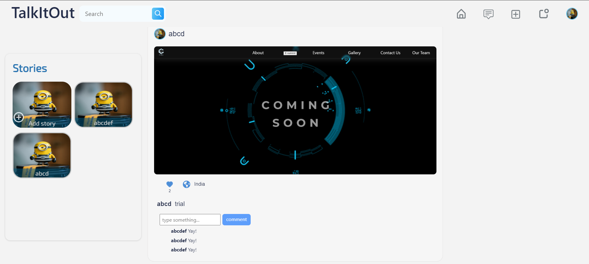
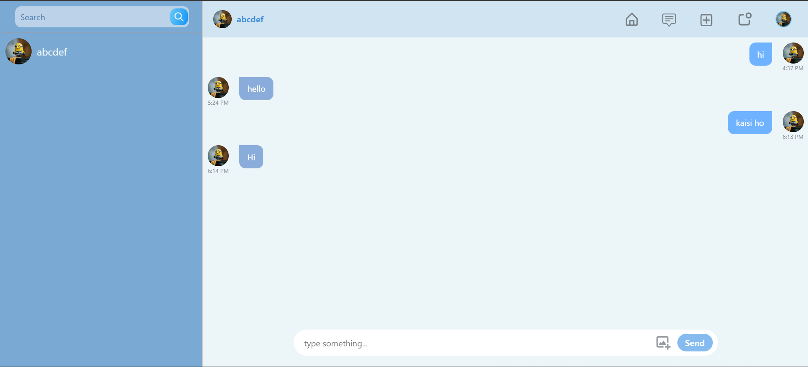
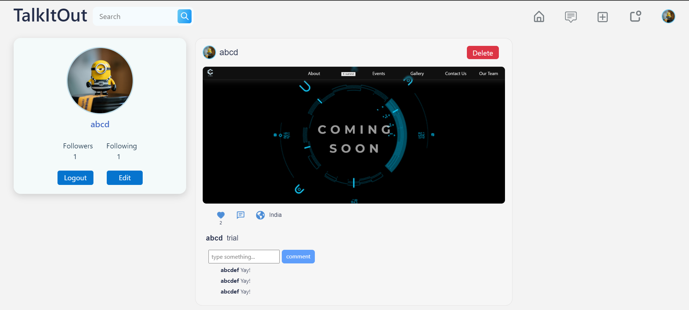

# TalkItOut

Welcome to TalkItOut! This social media platform allows users to create accounts, post pictures or videos publicly, comment and like posts, follow other users, chat with friends, and add stories visible to their friends. Below, you'll find instructions on how to set up and run the application, as well as screenshots showcasing its features.

## Features

- **Account Creation**: Sign up and create your personal account.
- **Posting**: Share pictures or videos with the community.
- **Interactions**: Comment on and like other users' posts.
- **Follow Users**: Follow other users to see their posts on your feed.
- **Chat**: Engage in private conversations with other users.
- **Stories**: Add temporary stories visible only to your friends.

## Usage

1. **Create an Account**: Sign up using your email and create a password.
2. **Post Content**: Upload pictures or videos to share with the community.
3. **Interact with Posts**: Like and comment on posts to engage with other users.
4. **Follow Users**: Follow other users to see their content on your feed.
5. **Chat**: Use the chat feature to message your friends privately.
6. **Add Stories**: Share stories that will be visible to your friends for 24 hours.

## Screenshots

### 1. Landing

### 2. Home Feed

### 3. Chat

### 4. Profile

## Try It Out

You can try out the TalkItOut application by visiting the deployment link below:

[TalkItOut - Try It Now](https://talk-it-out-sigma.vercel.app/)

---

Thank you for using TalkItOut! We hope you enjoy connecting with friends and sharing your moments.

For any queries, please contact [AdiRocks007](https://github.com/AdiRocks007).
# TalkItOut
